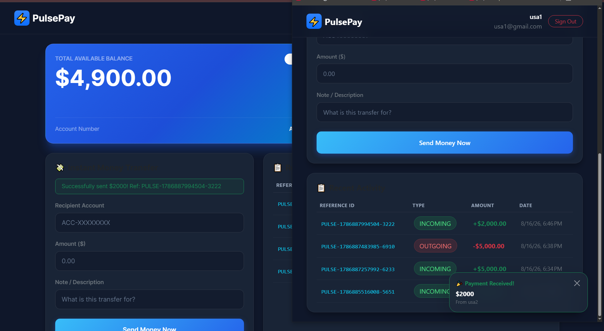

# ⚡ PulsePay Backend API

Node.js, Express, TypeScript, and MongoDB REST API powering the PulsePay digital banking engine.

---

## 🛠 Tech Stack

- **Runtime**: Node.js
- **Framework**: Express.js
- **Language**: TypeScript
- **Database**: MongoDB Atlas (Mongoose ODM)
- **Real-Time**: Socket.io
- **Auth & Security**: JWT (JSON Web Tokens), bcrypt.js

---

## 🔑 Environment Variables

Create a `.env` file in the root of the backend folder:

PORT=5000
MONGO_URI=mongodb+srv://<username>:<password>@cluster0.mongodb.net/pulsepay?retryWrites=true&w=majority
JWT_SECRET=your_super_secret_jwt_key
CLIENT_URL=http://localhost:4200

---

## 📡 API Endpoints Summary

### Authentication (/api/auth)
- POST /register — User signup + dynamic bank account provisioning
- POST /login — User authentication + JWT token generation

### Transfers & Banking (/api/transfers)
- POST /send — ACID-compliant peer-to-peer transfer (triggers Fraud Shield $5,000+ PIN verification)
- GET /account-info — Fetch current account details & balance

### Transactions (/api/transactions)
- GET /history — Fetch user transaction history logs

---

## ⚡ Socket.io Events

- join_user_room — Client joins a dedicated personal socket room via userId.
- payment_received — Emitted by backend to recipient's room upon successful money transfer.

---

## 🚀 Running the Server

# Install dependencies
npm install

# Start development server
npm run dev

# 📸 Project Preview

## Dashboard & Dark Glassmorphism UI

---

## Real-Time Payment Notifications (SOCKET.IO)

---

## AI Fraud Shield 2FA Verification ($5,000+)

---

## Instant Money Transfer

---

## Registration & Dynamic Account Provisioning

---

# 👨‍💻 Author

### Usama Ali

GitHub: https://github.com/syedusamaali-dev

---